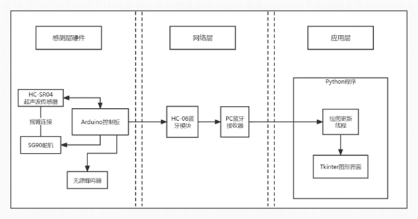

# 基于超声波测距的可动扫描雷达(Arduino)

## 项目描述

> 这是一个基于Arduino开发板制作的简易扫描雷达

### 架构设计

**网络层：**

通过电脑蓝牙连接HC-06模块，
使用Python的serial库进行调用端口与Arduino进行串口通信

 **感应层** **：**

使用超声波传感器，利用压电效应的原理将电能和超声波相互转化，通过测量超声波返回的时间计算距离，同时读取舵机位置得知方位角，经过程序处理后可实现短距离内对周围环境的测绘分析。

**应用层：**

使用Python的Tkinter库编写图形界面，我们所构建的项目可以应用与其他所需探测功能的物体上，在PC或其他设备上能够获取到测绘结果，从而达到物联网应用能够对周围地形环境有一定认识，并且能够对障碍物等物品做出相应的操作反馈。

### 硬件示意图

### 架构设计图

## 运行效果

### 实物图

程序效果

